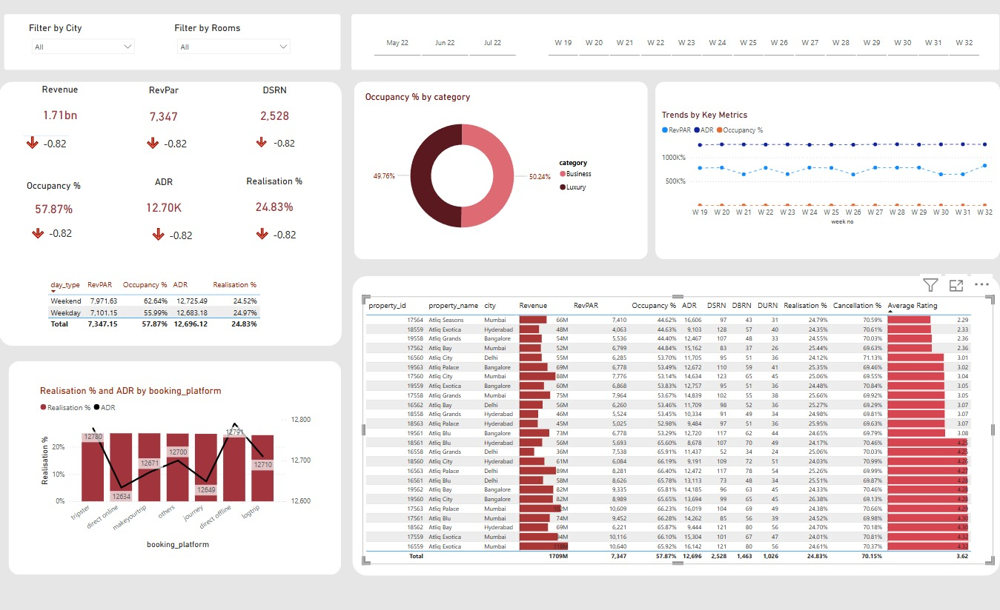

# 🏨 Hotel Booking Analytics Dashboard – Power BI

This project is a Power BI dashboard designed to analyze hotel performance across multiple cities and platforms. It covers KPIs like revenue, occupancy, average daily rate (ADR), cancellations, and guest ratings, helping stakeholders make data-driven decisions.

---

## 📊 Dashboard Highlights

- **Total Revenue:** ₹1.71B
- **RevPAR (Revenue per Available Room):** ₹7,347
- **Occupancy Rate:** 57.87%
- **ADR (Average Daily Rate):** ₹12,700
- **Realisation %:** 24.83%
- **Cancellation % and Ratings** tracked at property level

---

## 🏗️ Data Model

This dashboard uses a star schema with the following structure:

- `dim_date`: Date reference table
- `dim_hotels`: Hotel metadata (city, category, etc.)
- `dim_rooms`: Room configurations
- `fact_bookings`: Raw booking-level data
- `fact_aggregated_bookings`: Aggregated metrics for better performance

---

## 📐 Measures Used

- **Revenue**: Total revenue realized from all bookings across hotels

- **RevPAR (Revenue per Available Room)**: Measures average revenue generated per available room, regardless of whether it was booked

- **DSRN (Daily Sellable Room Nights)**: Represents the average number of rooms available for sale per day during the selected time period

- **Occupancy %**: Indicates how much of the available room capacity was actually booked

- **ADR (Average Daily Rate)**: The average price paid per room sold, calculated as total revenue divided by rooms sold

- **Realisation %**: Percentage of successful "checked out" bookings over total bookings — indicates revenue retention or fulfillment efficiency

---

## 🔍 Key Insights Enabled

- Compare performance between Business vs Luxury categories
- Analyze weekday vs weekend booking behaviors
- Spot trends across weeks using slicers and time-series analysis
- Compare platform-wise performance (direct, OTA, etc.)
- Drill-down into city or property-level metrics

---

## 🧩 Tools Used

- **Power BI Desktop**
- **DAX (Data Analysis Expressions)**
- **CSV data from simulated hotel bookings**
